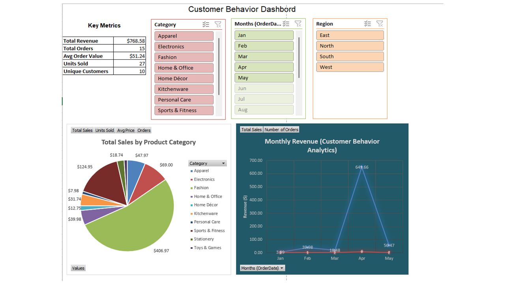

# 👥 Customer Behavior Analytics

This project analyzes customer behavior using SQL and Excel.  
It simulates an online store and explores sales patterns, product categories, and regional performance.  
The goal is to extract insights from customer data and visualize them in a clean, interactive dashboard.

---

## 🛠 Tools Used
- **MySQL Workbench** – for database creation, data analysis, and manipulation
- **Microsoft Excel** – for building dashboards using pivot tables, slicers, and charts

---

## 🗂 Project Files

### 1. `Customer_Behavior_Full_Project.sql`
- Creates database `OnlineStore2`
- Builds tables: `Customers`, `Products`, `Orders`
- Fills in sample data
- Runs analytical queries for:
  - Sales trends
  - Product/category performance
  - Regional metrics

### 2. `Customer_Behavior_Analytics_Dashboard.xlsx`
- Raw data from SQL: `Customers`, `Products`, `Orders`
- Pre-calculated fields: Total Amount, Monthly Revenue
- Pivot tables for:
  - Total sales by category
  - Monthly revenue
- Dashboard: slicers + key metrics block (KPIs)

### 3. `Customer_Behavior_Dashboard.png`
- Final dashboard screenshot

---

## 🧱 Database Structure

### Customers
- `CustomerID` (INT, PK)  
- `Name` (VARCHAR)  
- `Region` (VARCHAR)

### Products
- `ProductID` (INT, PK)  
- `ProductName` (VARCHAR)  
- `Category` (VARCHAR)

### Orders
- `OrderID` (INT, PK)  
- `CustomerID` (FK)  
- `ProductID` (FK)  
- `Quantity` (INT)  
- `Price` (DECIMAL)  
- `OrderDate` (DATETIME)

---

## 🔍 Key Insights from SQL
- Total Revenue per Customer  
- Orders per Region  
- Most Popular Products  
- Monthly Sales Trends  
- Sales by Product Category  
- Unique Customers per Region  
- Customers Without Orders

---

## 📊 Excel Dashboard Features

### 🔢 KPI Metrics
- Total Revenue: `$768.58`
- Total Orders: `15`
- Avg Order Value: `$51.24`
- Units Sold: `27`
- Unique Customers: `10`

### 📈 Visualizations
- Pie Chart → **Total Sales by Product Category**
- Line Chart → **Monthly Revenue**
- Slicers → by **Category**, **Month**, and **Region**

---

## 📸 Dashboard Preview

---

## 🧠 Skills Practiced
- Writing SQL queries with `JOIN`, `GROUP BY`, `SUM`, `COUNT`, `HAVING`
- Preparing and exporting data from SQL to Excel
- Building KPI dashboards with slicers and pivot charts
- Data storytelling and insight generation

---

## 🎓 What I Learned

This project helped me strengthen my SQL analytics skills and practice building Excel dashboards.  
I also learned how to explore customer patterns and present key business metrics visually and clearly.
